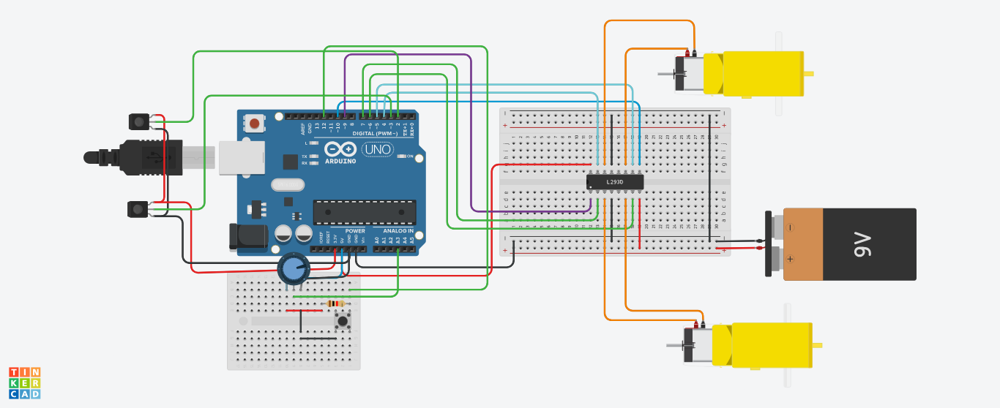

# Autonomous Line-Following Robot 🚀

A competition-ready robot designed for the **Tread-O-Quest Challenge**, capable of line following, obstacle detection, and edge navigation using PID control and IR sensors.

## Features ✨
- **PID-based line tracking** with 5 IR sensors
- **Edge detection** for 15cm-wide tracks
- **Obstacle avoidance** with ultrasonic/IR sensors
- **Checkpoint navigation** using state-machine logic

## Hardware Components 🔧
- Arduino Uno
- L298N Motor Driver
- IR Sensors (x5)
- LEDs (Red/Green for obstacle indication)

## Circuit Diagram 🔌

## Usage 🛠️
1. Upload `Code/main.ino` to Arduino.
2. Calibrate IR sensors using the potentiometer.
3. Place the robot on the track and press the start button.

[Full Documentation](Documentation/Project_Report.pdf)
